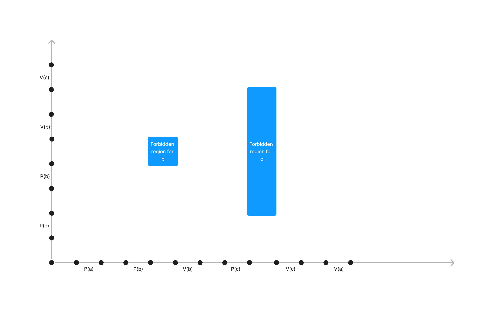

It can't deadlock, any trajectory has a way out of the corresponding graph



```
Initially: a = 1, b = 1, c = 1.


Thread 1:	Thread 2:
P(a);	    P(c);
P(b);	    P(b);
V(b);	    V(b);
P(c);	    V(c);
V(c);
V(a);
```
