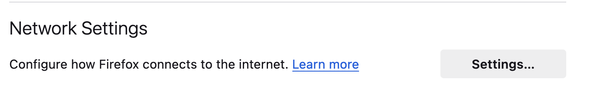
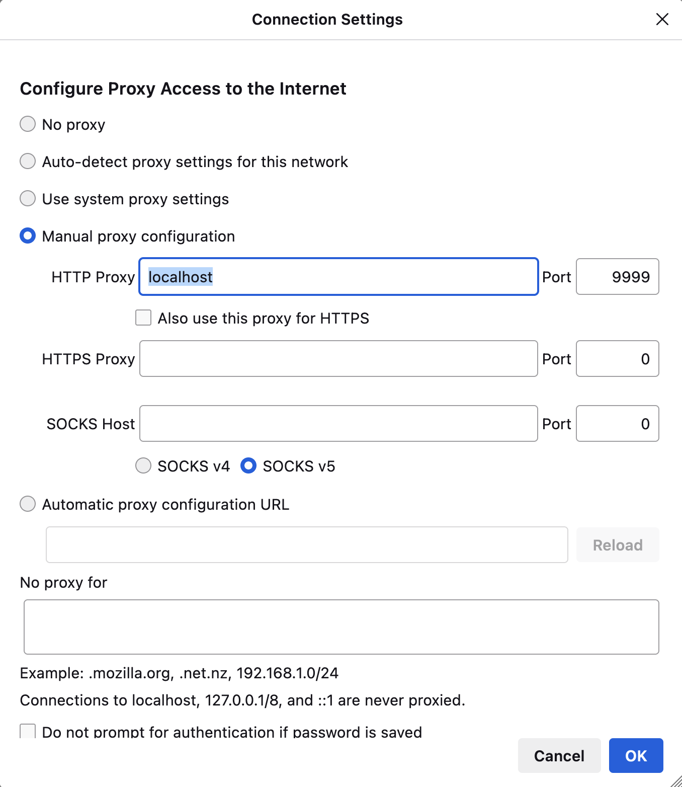
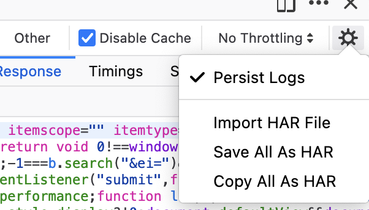
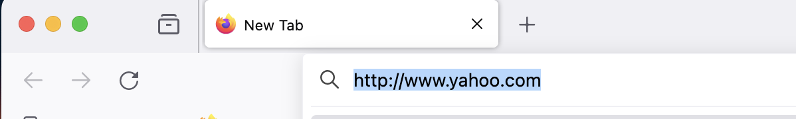
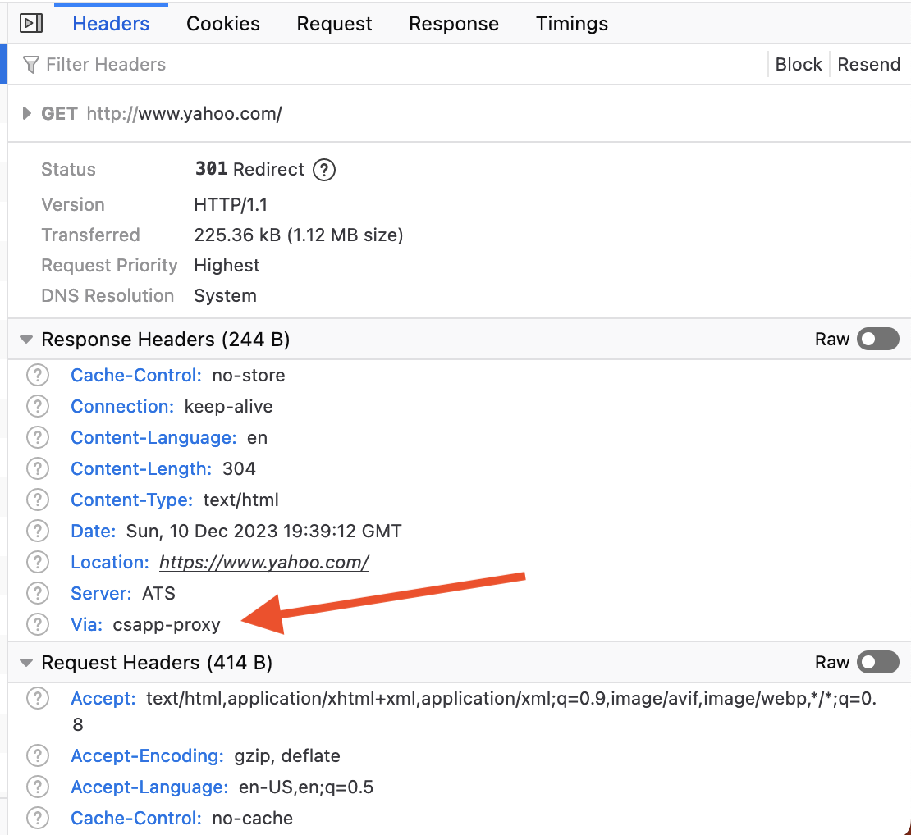

# A

This single threaded proxy-server will use a listening port specified as a command argument.<br/>
Logging is done to `proxy.log` and blocked-list is configured in `blocked.conf`.<br/>
The proxy handle two cases of responses:<br/>
- Chunked responses which should end with double CRLF (`\r\n\r\n`)
- Replies with `Content-Length` header specifying how big the response body is (Added this after my proxy blocked when calling `http://www.yahoo.com`)

In case the requested URL is in the blocked-list, we return a `HTTP/1.1 400 No way Jose!` response to the client.

### Please note!
This is a very naive implemenation of an http proxy server
- Only HTTP 1.1 is supported
- No TLS support
- In case the server lies about the `Content-Length` header value it has the potential to hold the connection and block our read.
- In general, there's no timeout mechanism implemented in the client side, so the server can block us anyway by not sending a complete response.
- There are other encoding options such as `gzip`, `compress`, etc... which are not supported

The above of course can be addressed, but I think it is good enough for a fun learning experience.


For parsing the path from the request URL, I implemented a utility method called `parse_http_url`
## URL parsing

### url.h
```c
#ifndef __URL_H__
#define __URL_H__

#include <stdio.h>
#include <stdlib.h>

typedef enum
{
    VALID_URL,
    INVALID_SCHEMA_ERR,
    INVALID_HOST_ERR,
    HOST_BUFFER_TOO_SHORT_ERROR,
    INVALID_PORT_ERROR,
    PORT_BUFFER_TOO_SHORT_ERROR,
    PATH_BUFFER_TOO_SHORT_ERROR,
} http_url_error;

char *http_url_parse_error_msg(http_url_error error);

http_url_error parse_http_url(const char *url, char *hostbuf, int hostbuflen,
                              char *portbuf, int portbuflen, char *pathbuf, int pathbuflen);

#endif /* __URL_H__ */
```

### url.c
```c
#include <stdlib.h>
#include <string.h>
#include <ctype.h>
#include "url.h"

#define HTTP_SCHEME "http://"
#define HTTP_SCHEME_LEN 7
#define ISDIGIT(x) isdigit((unsigned char)(x))

/*
    Naive implementation of URL parsing (No hostname or path structure validation)
*/
http_url_error parse_http_url(const char *url, char *hostbuf, const int hostbuflen, char *portbuf, const int portbuflen,
                              char *pathbuf, const int pathbuflen) {
    int i, hostbuf_i = 0, portbuf_i = 0, pathbuf_i = 0;

    if (strncasecmp(url, HTTP_SCHEME, 5)) {
        return INVALID_SCHEMA_ERR;
    }
    
    // parse host
    hostbuf_i = 0;
    for (i = HTTP_SCHEME_LEN; url[i] && url[i] != ':' && url[i] != '/' && hostbuf_i < hostbuflen; i++, hostbuf_i++) {
        hostbuf[hostbuf_i] = url[i];
    }
    if (hostbuf_i >= hostbuflen) return HOST_BUFFER_TOO_SHORT_ERROR; // not enough space in host buffer
    if (i == HTTP_SCHEME_LEN) return INVALID_HOST_ERR; // no host specified
    hostbuf[hostbuf_i] = '\0'; // terminate host string

    // parse port
    if (url[i] == ':') { // the url might have a port
        // We have a colon delimiting the hostname. It could mean that a port number is following it
        if (ISDIGIT(url[++i])) {  // A port number
            portbuf_i = 0;
            for (; url[i] && url[i] != '/' && portbuf_i < portbuflen; i++, portbuf_i++) {
                if (!ISDIGIT(url[i])) return INVALID_PORT_ERROR;
                portbuf[portbuf_i] = url[i];
            }
            if (portbuf_i >= portbuflen) return PORT_BUFFER_TOO_SHORT_ERROR; // not enough space in port buffer
            portbuf[portbuf_i] = '\0'; // terminate port string
        }
    } else {
        portbuf[0] = '\0';
    }

    // parse path
    if (url[i] == '/') {
        for (; url[i] != '\0'; i++ && pathbuf_i < pathbuflen, pathbuf_i++) {
            pathbuf[pathbuf_i] = url[i];
        }
        if (pathbuf_i >= pathbuflen) return PATH_BUFFER_TOO_SHORT_ERROR; // not enough space in path buffer
        pathbuf[pathbuf_i] = '\0'; // terminate path string
    } else {
        pathbuf[0] = '\0';
    }

    return VALID_URL;
}

char *http_url_parse_error_msg(http_url_error error) {
    switch (error)
    {
    case VALID_URL:
        return "URL is valid";
    case INVALID_SCHEMA_ERR:
        return "Invalid URL schema";
    case INVALID_HOST_ERR:
        return "Invalid hostname";
    case HOST_BUFFER_TOO_SHORT_ERROR:
        return "Not enough buffer space for storing the parsed hostname";
    case INVALID_PORT_ERROR:
        return "Invalid port";
    case PORT_BUFFER_TOO_SHORT_ERROR:
        return "Not enough buffer space for storing the parsed port";
    case PATH_BUFFER_TOO_SHORT_ERROR:
        return "Not enough buffer space for storing the parsed path";

    default:
        fprintf(stderr, "Undefined url parsing error");
        exit(1);
    }
}

```

## 39_a.c
```c
#include "csapp.h"
#include "url.h"

#define HTTP_DEFAULT_PORT "80"
#define LOG_FILE "proxy.log"
#define BLOCKED_FILE "blocked.conf"
#define CONTENT_LENGTH_HEADER_PREFIX "Content-Length:"
#define CONTENT_LENGTH_HEADER_PREFIX_LEN 15
#define VIA_HEADER "Via"
#define CSAPP_PROXY "csapp-proxy"

static void serve(int connfd, int logfd);
static void logline(int logfd, const char *format, ...);
char** read_lines(int fd, int *line_count);
int is_blocked(char *url);

static char **blocked_list;
static int blocked_cnt;

int main(int argc, char* argv[]) {
    char *port;
    int listenfd, connfd, logfd, blockedfd;
    struct sockaddr_storage clientaddr;
    socklen_t clientlen;
    char client_host[MAXLINE], client_port[MAXLINE];
    char logbuf[MAXBUF];

    if (argc != 2) {
        printf("Usage: %s <port>", argv[0]);
    }

    port = argv[1];
    listenfd = Open_listenfd(port);

    // Open log file in append mode or create it if it doesn't exist
    logfd = Open(LOG_FILE, O_WRONLY | O_APPEND | O_CREAT, S_IRUSR | S_IWUSR);
    blockedfd = Open(BLOCKED_FILE, O_RDONLY, 0);

    blocked_list = read_lines(blockedfd, &blocked_cnt);

    while (1) {
	    clientlen = sizeof(clientaddr);
        connfd = Accept(listenfd, (SA *) &clientaddr, &clientlen);
        Getnameinfo((SA *) &clientaddr, clientlen, client_host, MAXLINE, client_port, MAXLINE, 0);

        logline(logfd, "Accepted connection from %s:%s", client_host, client_port);
        
        serve(connfd, logfd);
        Close(connfd);
    }

    Close(logfd);
}

static void serve(int connfd, int logfd) {
    int remote_server_fd;
    rio_t client_rio, remote_server_rio;
    ssize_t line_size;
    char method[MAXLINE], uri[MAXLINE], version[MAXLINE], host[MAXLINE], port[MAXLINE], path[MAXLINE];
    char buf[MAXBUF], logbuf[MAXBUF];
    http_url_error parse_err;
    Rio_readinitb(&client_rio, connfd);
    if (!Rio_readlineb(&client_rio, buf, MAXLINE))
        return;

    sscanf(buf, "%s %s %s", method, uri, version);
    logline(logfd, "method = %s, URI = %s, version = %s", method, uri, version);

    if (is_blocked(uri)) {
        logline(logfd, "URI %s is blocked and won't be forwarded", uri);
        sprintf(buf, "HTTP/1.1 400 No way Jose!\r\n\r\nYou're trying to reach %s through this proxy\r\nnot on my watch!\r\n", uri);
        Rio_writen(connfd, buf, strlen(buf));
        return;
    }
    
    parse_err = parse_http_url(uri, host, MAXLINE, port, MAXLINE, path, MAXLINE);
    if (parse_err != VALID_URL) {
        logline(logfd, "Error parsing destination URL (%s), traffic will not be forwarded", http_url_parse_error_msg(parse_err));
        return;
    }

    if (port[0] == '\0') strcpy(port, HTTP_DEFAULT_PORT);
    logline(logfd, "host = %s, port = %s, path = %s", host, port, path);

    // connect remote server
    remote_server_fd = Open_clientfd(host, port);

    // write a modified request (just the path part, not the full URL)
    sprintf(buf, "%s %s %s\r\n", method, path, version);
    Write(remote_server_fd, buf, strlen(buf));
    
    // forward request headers from the client to the remote server
    while (strcmp(buf, "\r\n")) {
        line_size = Rio_readlineb(&client_rio, buf, MAXBUF - 1);
        buf[line_size] = '\0';
        Rio_writen(remote_server_fd, &buf, line_size);
    }

    // send the remote server response back to the client
    Rio_readinitb(&remote_server_rio, remote_server_fd);
    int content_length = -1;
    int tmp = 0;
    char content_length_buf[50];
    
    // send response headers back to the client
    while ((line_size = Rio_readlineb(&remote_server_rio, buf, MAXLINE - 1)) > 0) {
        if (!strncasecmp(buf, CONTENT_LENGTH_HEADER_PREFIX, CONTENT_LENGTH_HEADER_PREFIX_LEN) &&
            sscanf(buf, "%49s%*[ \t]%d", content_length_buf, &tmp) == 2) { // Content-Length header
            content_length = tmp;
        }
        
        if (!strncmp(buf, "\r\n\r\n", line_size)) { // end of headers
            sprintf(buf, "%s:%s\r\n\r\n", VIA_HEADER, CSAPP_PROXY); // Add our signature :)
            Rio_writen(connfd, buf, strlen(buf));
            break;
        }

        Rio_writen(connfd, buf, line_size);
    }

    // send response body back to the client
    if (content_length >= 0) {
        ssize_t written_bytes = 0;
        ssize_t remaining = content_length;
        while ((written_bytes = Rio_readnb(&remote_server_rio, buf, remaining))) {
            remaining -= written_bytes;
            Rio_writen(connfd, buf, written_bytes);
        }
    } else {
        // Assume response ends up with double CRLF ("\r\n\r\n")
        while ((line_size = Rio_readlineb(&remote_server_rio, buf, MAXLINE - 1)) > 0) { // read and forward
            Rio_writen(connfd, buf, line_size);
            if (!strncmp(buf, "\r\n\r\n", line_size)) break;
        }
    }

    Close(remote_server_fd);
}

static void logline(int logfd, const char *format, ...) {
    char logbuf[MAXBUF];
    static char newline = '\n';
    time_t current_time;

    va_list args;
    va_start(args, format);

    time(&current_time);
    struct tm *timeinfo;
    timeinfo = localtime(&current_time); // get local time
    strftime(logbuf, sizeof(logbuf), "[%Y-%m-%d %H:%M:%S]\t", timeinfo);

    Write(logfd, logbuf, strlen(logbuf));
    vsprintf(logbuf, format, args);
    Write(logfd, logbuf, strlen(logbuf));
    Write(logfd, &newline, 1);

    va_end(args);
}

char** read_lines(int fd, int *line_count) {
    char** lines = NULL;
    char buf[MAXBUF];
    rio_t rio;
    int count = 0;

    Rio_readinitb(&rio, fd);
    ssize_t line_size;
    while ((line_size = Rio_readlineb(&rio, buf, MAXBUF)) > 0) {
        lines = Realloc(lines, (count + 1) * sizeof(char*));
        buf[line_size - 1] = '\0'; // replace '\n' with a null terminator
        lines[count] = strdup(buf);
        count++;
    }

    *line_count = count;
    return lines;
}

int is_blocked(char *url) {
    for (int i = 0; i < blocked_cnt; i++) {
        if (strcmp(url, blocked_list[i]) == 0) return 1;
    }
    return 0;
}
```

## Compiling and running
```
> clang 39_a.c csapp.c url.c -o 39 && ./39 9999
... Compiler output ...
```

Now from another terminal, we can use curl for testing the proxy program:
#### http://www.google.com
```
> curl -i --proxy http://localhost:9999 "http://www.google.com"

HTTP/1.1 200 OK
Date: Sun, 10 Dec 2023 19:46:19 GMT
Expires: -1
Cache-Control: private, max-age=0
Content-Type: text/html; charset=ISO-8859-1
Content-Security-Policy-Report-Only: object-src 'none';base-uri 'self';script-src 'nonce-uy1He6nTfrumYjFkk0ynwg' 'strict-dynamic' 'report-sample' 'unsafe-eval' 'unsafe-inline' https: http:;report-uri https://csp.withgoogle.com/csp/gws/other-hp
P3P: CP="This is not a P3P policy! See g.co/p3phelp for more info."
Server: gws
X-XSS-Protection: 0
X-Frame-Options: SAMEORIGIN
Set-Cookie: 1P_JAR=2023-12-10-19; expires=Tue, 09-Jan-2024 19:46:19 GMT; path=/; domain=.google.com; Secure
Set-Cookie: AEC=Ackid1S5ZFkvUFFFToLLF7XFF1Ya4ZHy2GPBjvEgT6nxPPamJiUiQJtPDRo; expires=Fri, 07-Jun-2024 19:46:19 GMT; path=/; domain=.google.com; Secure; HttpOnly; SameSite=lax
Set-Cookie: NID=511=sW_cfTL2NrJmWAoALtUJIBx_rc9pLEIOmqApEB5mt58O1cqvZn8Uec2An_abSZ1y7sKIz1JXEFMZdnY7dsND9eoA1n72XyzVc3uCxY4488mej66D1hj-5aaDl6wksnYdtItzkN1Zs6ahWKbSclM6MCNADxrm_47w-n2QUKtxSQk; expires=Mon, 10-Jun-2024 19:46:19 GMT; path=/; domain=.google.com; HttpOnly
Accept-Ranges: none
Vary: Accept-Encoding
Transfer-Encoding: chunked
Via:csapp-proxy

<!doctype html>
... response body truncated...
</body></html>
```

#### http://www.yahoo.com
```
> curl -i --proxy http://localhost:9999 "http://www.yahoo.com"

HTTP/1.1 301 Redirect
Date: Sun, 10 Dec 2023 19:46:23 GMT
Proxy-Connection: keep-alive
Server: ATS
Cache-Control: no-store
Location: https://www.yahoo.com/
Content-Type: text/html
Content-Language: en
Content-Length: 304
Via:csapp-proxy

<HTML>
<HEAD>
<TITLE>Document Has Moved</TITLE>
</HEAD>

<BODY BGCOLOR="white" FGCOLOR="black">
<H1>Document Has Moved</H1>
<HR>

<FONT FACE="Helvetica,Arial"><B>
Description: The document you requested has moved to a new location.  The new location is "https://www.yahoo.com/".
</B></FONT>
<HR>
</BODY>
```

#### http://www.blocked.com
```
> curl -i --proxy http://localhost:9999 "http://www.blocked.com"

HTTP/1.1 400 No way Jose!

You're trying to reach http://www.blocked.com/ through this proxy
not on my watch!
```

#### Checking proxy.log
```
> cat proxy.log

[2023-12-10 21:46:18]	Accepted connection from localhost:56892
[2023-12-10 21:46:18]	method = GET, URI = http://www.google.com/, version = HTTP/1.1
[2023-12-10 21:46:18]	host = www.google.com, port = 80, path = /
[2023-12-10 21:46:22]	Accepted connection from localhost:56894
[2023-12-10 21:46:22]	method = GET, URI = http://www.yahoo.com/, version = HTTP/1.1
[2023-12-10 21:46:22]	host = www.yahoo.com, port = 80, path = /
[2023-12-10 21:46:27]	Accepted connection from localhost:56900
[2023-12-10 21:46:27]	method = GET, URI = http://www.blocked.com/, version = HTTP/1.1
[2023-12-10 21:46:27]	URI http://www.blocked.com/ is blocked and won't be forwarded
```

# B
The modification to a multithreaded proxy involves modifying the `serve` function to a pthread routine and creating a new thread per connection.

```diff
--- 39_a.c	2023-12-10 21:35:26
+++ 39_b.c	2023-12-10 21:38:48
@@ -9,7 +9,12 @@
 #define VIA_HEADER "Via"
 #define CSAPP_PROXY "csapp-proxy"
 
-static void serve(int connfd, int logfd);
+typedef struct {
+    int connfd;
+    int logfd;
+} serve_params;
+
+static void *serve(void *vargp);
 static void logline(int logfd, const char *format, ...);
 char** read_lines(int fd, int *line_count);
 int is_blocked(char *url);
@@ -19,7 +24,8 @@
 
 int main(int argc, char* argv[]) {
     char *port;
-    int listenfd, connfd, logfd, blockedfd;
+    int connfd, listenfd, logfd, blockedfd;
+    pthread_t tid;
     struct sockaddr_storage clientaddr;
     socklen_t clientlen;
     char client_host[MAXLINE], client_port[MAXLINE];
@@ -40,19 +46,26 @@
 
     while (1) {
 	    clientlen = sizeof(clientaddr);
+        serve_params *params = (serve_params *) Malloc(sizeof(serve_params));
         connfd = Accept(listenfd, (SA *) &clientaddr, &clientlen);
         Getnameinfo((SA *) &clientaddr, clientlen, client_host, MAXLINE, client_port, MAXLINE, 0);
-
         logline(logfd, "Accepted connection from %s:%s", client_host, client_port);
         
-        serve(connfd, logfd);
-        Close(connfd);
+        params->connfd = connfd;
+        params->logfd = logfd;
+        Pthread_create(&tid, NULL, serve, params);
     }
 
     Close(logfd);
 }
 
-static void serve(int connfd, int logfd) {
+static void *serve(void *vargp) {
+    Pthread_detach(Pthread_self());
+
+    serve_params *params = (serve_params *) vargp;
+    int connfd = params->connfd;
+    int logfd = params->logfd;
+
     int remote_server_fd;
     rio_t client_rio, remote_server_rio;
     ssize_t line_size;
@@ -60,8 +73,10 @@
     char buf[MAXBUF], logbuf[MAXBUF];
     http_url_error parse_err;
     Rio_readinitb(&client_rio, connfd);
-    if (!Rio_readlineb(&client_rio, buf, MAXLINE))
-        return;
+    if (!Rio_readlineb(&client_rio, buf, MAXLINE)) {
+        Close(connfd);
+        return NULL;
+    }
 
     sscanf(buf, "%s %s %s", method, uri, version);
     logline(logfd, "method = %s, URI = %s, version = %s", method, uri, version);
@@ -70,13 +85,15 @@
         logline(logfd, "URI %s is blocked and won't be forwarded", uri);
         sprintf(buf, "HTTP/1.1 400 No way Jose!\r\n\r\nYou're trying to reach %s through this proxy\r\nnot on my watch!\r\n", uri);
         Rio_writen(connfd, buf, strlen(buf));
-        return;
+        Close(connfd);
+        return NULL;
     }
     
     parse_err = parse_http_url(uri, host, MAXLINE, port, MAXLINE, path, MAXLINE);
     if (parse_err != VALID_URL) {
         logline(logfd, "Error parsing destination URL (%s), traffic will not be forwarded", http_url_parse_error_msg(parse_err));
-        return;
+        Close(connfd);
+        return NULL;
     }
 
     if (port[0] == '\0') strcpy(port, HTTP_DEFAULT_PORT);
@@ -135,6 +152,8 @@
     }
 
     Close(remote_server_fd);
+    Close(connfd);
+    return NULL;
 }
 
 static void logline(int logfd, const char *format, ...) {
```

## Testing with Firefox
### Configuring proxy settings:
1. Under firefox settings, scroll down to the Network section and click "Settings..."

2. Choose "Manual proxy configuration" and set the proxy hostname and port

3. Open developer tools
   - Check persist logs in order to preserve logs in case of redirect
   - Check "Disable Cache" to make sure the browser calls our proxy and not fetch response from a local cache.


### Now, let's try it!

When checking the dev tools for the response headers, we can see the proxy added the `Via` header

