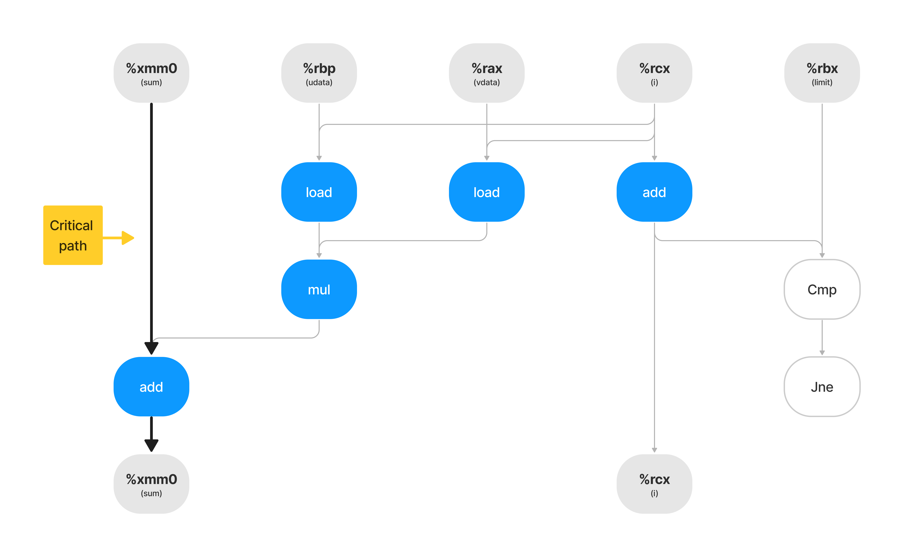

## A

## B
For data type double, we have a latency of 3 cycles for the add operation.
Our critical path includes only the add operation, therefore, our Lowest bound is 3 cycles.

## C
For an integer data type, we get a latency value of 1 cycles for the add operaion.
Since our critical path only includes the add operation, our Lowest bound is 1 cycle.

## D
Only the add operation is in the critical path.