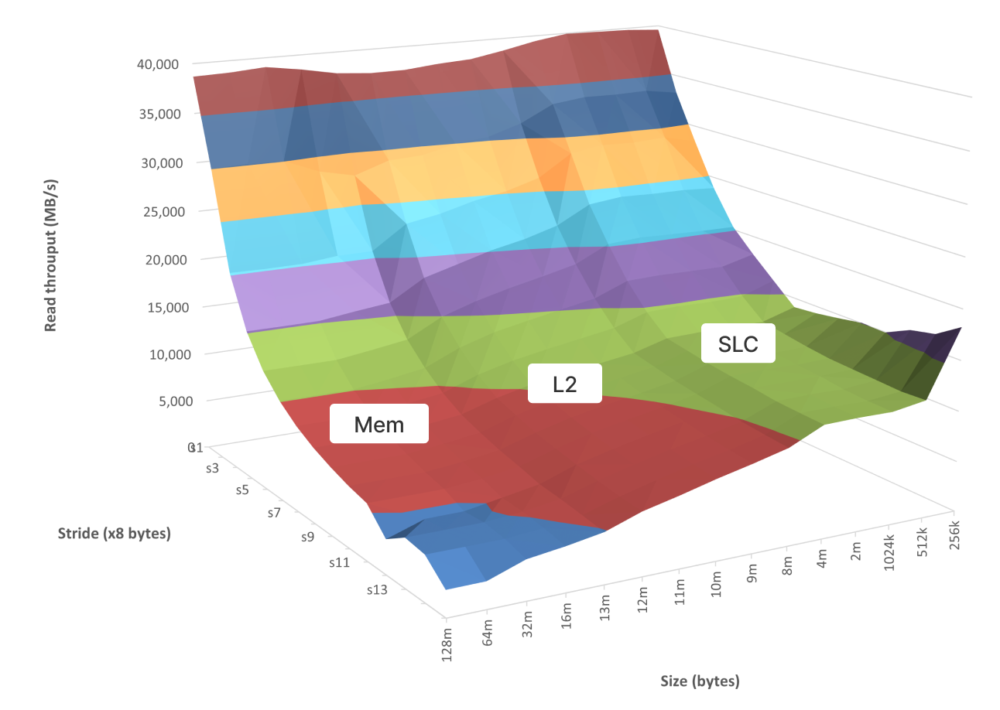

# Running the mountain program on Apple M1 Pro machine
First, we need to take care of compatibility with the M1 architecture.

I downloaded the mountain program (with the source code) from the CSAPP website.<br>
Running it as is gave the following output:
```
> ./mountain
zsh: exec format error: ./mountain
```
This probably means the program was compiled for a different OS and architecture. So I decided to recompile it.

My first attempt to compile the program failed:
```bash
> make clean && make mountain
... (output truncated)
clock.c:19:9: error: unknown register name '%edx' in asm
      : "%edx", "%eax");
        ^
4 errors generated.
```
That's an x86 assembly code within `clock.c` that can't be used for our arm architecture.
Luckily, we can direct the clang compiler to compile for a specific arch with:
```bash
clang -O3 -o mountain -arch x86_64 mountain.c fcyc2.c clock.c
```

Then, running the program gives:
```
Can't open /proc/cpuinfo to get clock information
Clock frequency is approx. 1000.0 MHz
Memory mountain (MB/sec)
        s1      s2      s3      s4      s5      s6      s7      s8      s9      s10     s11     s12     s13     s14     s15
128m    49104   27667   18875   14194   11336   9444    8074    7115    6368    5757    5260    4825    4508    4210    3938
64m     50631   28319   19073   14358   11452   9496    8180    7178    6431    5784    5293    4835    4515    4231    3948
32m     50798   28579   19133   14343   11458   9477    8157    7133    6386    5808    5307    4850    4533    4239    3946
16m     48187   28926   19799   14898   12000   9923    8538    7514    6723    6098    5617    5199    4816    4510    4245
8m      52565   40639   30826   24721   19914   16595   14231   12464   12118   11773   11468   11155   10876   10644   10461
4m      53573   41908   32017   25680   20670   17190   14764   12906   12567   12291   11994   11700   11437   11217   11038
2m      53488   41943   31957   25785   20670   17225   14764   12893   12595   12276   11978   11683   11455   11235   11037
1024k   53545   41806   31897   25784   20713   17191   14734   12893   12595   12275   12042   11651   11454   11236   11112
512k    55433   43095   34100   25781   20629   17331   14855   12998   12595   12336   12042   11783   11663   11523   11494
256k    55188   43102   33829   25791   21700   18727   16052   14303   14564   14637   15887   15427   17278   18724   19973
128k    64220   60513   61709   60458   63014   65601   56228   49201   70014   63014   71347   65401   60735   56398   69904
64k     65536   71546   65601   65536   63014   65401   56060   65536   58248   52424   71771   65795   60735   56398   52639
32k     65536   65536   65795   49349   78952   65795   56398   49349   88780   39000   70905   66585   61463   55714   52000
16k     65536   65536   65795   49349   79902   66585   57073   49951   inf     39951   36317   inf     inf     28537   26634
```

Great, we have some output. Let's take a look at the mountain:

")
(`inf` values "interpulated")


## This is interesting, but...

There are few suspicious outcomes:

1. The mountain program is compiled for x86_64 architecture, means MacOS uses [Rosetta 2](https://en.wikipedia.org/wiki/Rosetta_(software)#Rosetta_2) to execute our program. What we're actully measuring is the x86 emulation performace.
2. The meassage that was printed to stderr - `Can't open /proc/cpuinfo to get clock information` and a false clock frequency printed later - `Clock frequency is approx. 1000.0 MHz`.
3. `inf` values at the 16k row


## Compiling for the M1 chip
I'm not sure if there's a significant affect on the mountain shape if we compile the program for an M1 chip. but it's worth checking.

The error received when compiling without the `--arch` parameter points on an assembly command `rdtsc` which is used to [measure CPU cycles](https://en.wikipedia.org/wiki/Time_Stamp_Counter) in X86 architecture.<br>
Since this command isn't part of the arm architecture, it can't be used on an M1 chip.

Luckily, a quick search got me to [this stackoverflow answer](https://stackoverflow.com/a/67968296/1163424) and I was able to modify clock.c to use the `cntct_el0` system register to retrieve the clock counter value.

Now I can finally compile directly for M1 with `clang -O3 -o mountain mountain.c fcyc2.c clock.c`.<br>
Running the compiled code gives different numbers:
```
Can't open /proc/cpuinfo to get clock information
Clock frequency is approx. 1000.0 MHz
Memory mountain (MB/sec)
        s1      s2      s3      s4      s5      s6      s7      s8      s9      s10     s11     s12     s13     s14     s15
128m    1616555 1249467 844950  632947  504739  420103  359554  314563  281692  252593  233309  137227  198857  185819  116153
64m     1615835 1243309 841849  631173  503726  419425  358432  314557  281305  252374  233274  193362  199390  186097  106588
32m     1627750 1249793 841343  630485  503329  418813  358472  314251  281018  251891  232784  191613  199437  186097  153122
16m     1602408 1189367 845668  642018  517975  436225  375606  328862  294865  265925  244737  216760  212332  198570  177904
8m      1624125 1344759 1145984 950227  808540  690761  592374  518327  501921  484330  473371  462947  449670  442530  439654
4m      1642249 1373380 1175863 970904  826463  703270  602803  527984  512688  496367  485115  477493  465567  458795  457643
2m      1655211 1387005 1192918 987360  838860  707540  606464  531732  515522  499321  486352  480115  467591  460911  459901
1024k   1656518 1387005 1201117 1000550 849049  716238  613918  539391  522457  506556  493912  485450  471690  468112  466033
512k    1669707 1394383 1205255 992970  845621  716238  613918  537180  520125  509010  501705  496477  485892  480115  485444
256k    1659139 1379705 1197000 992970  845613  766491  657000  595782  594429  595773  611051  661970  672133  693481  759826
128k    2016492 1927529 1899565 1820444 2016462 1820417 1872400 1638400 2080429 1638375 1985833 1820333 2016400 1872400 2184500
64k     2048000 2048000 1985909 1820444 2184500 2184400 1872400 1638400 1820250 2184333 1985667 1820333 1680333 2340500 2184500
32k     1927529 2048000 1820333 1638400 2184333 1820333 2340500 2048000 1820000 3276000 2978000 2730000 2520000 2340000 2184000
16k     2048000 2048000 1820333 2048000 3276000 2730000 2340000 2048000 1820000 1638000 inf     inf     inf     inf     1092000
```

The mountain shape is more or less similar to the x86 program version. but the clock frequency still isn't right.

")
(`inf` values interpulated)

## M1 Pro CPU cores & Clock frequency
An [Apple M1](https://en.wikipedia.org/wiki/Apple_M1#M1_Pro_and_M1_Max) Pro CPU has 2 Efficiency cores (a.k.a E-cores) clocked up to 2064 MHz peak, and 8 performance cores (a.k.a P-cores) clocked up to 3228 MHz.<br>
In addition, the clock frequency varies per core. ([read more](https://www.anandtech.com/show/17024/apple-m1-max-performance-review))

First, we need to understand which type of core we are measuring. Then, we need a way to measure the clock speed.

Taking a look at `Activity Monitor` > `CPU Load` shows activity in the performance cores correlated with the mountain program executions. So I assume our measurements are relevant to the performance cores.


Running `sysctl hw.cpufrequency` doesn't yield any result (it worked before with Apple computers with an Intel chip).


By running `sudo powermetrics -s cpu_power` we can see each CPU core usage and frequency.

But still, I couldn't find a way to determine which specific core is running the mountain program, and what its current clock rate.

Then I noticed there's a commented version of the `mhz` function in `clock.c`:
```c
///* Version using a default sleeptime */
// double mhz(int verbose)
//{
//   return mhz_full(verbose, 2);
// }
```

replacing the current `mhz` function with the commented one resulted with a frequency of 24.1 Mhz (what?!) and the following result:
```
Clock frequency is approx. 24.1 MHz
Memory mountain (MB/sec)
        s1      s2      s3      s4      s5      s6      s7      s8      s9      s10     s11     s12     s13     s14     s15
128m    38922   30084   20256   15187   12120   10091   8632    7564    6764    6107    5604    3558    4801    4477    2572
64m     38916   30073   20212   13534   12053   10074   8628    7544    6763    6103    5609    4617    4802    4476    2572
32m     39182   30047   20237   15188   12114   10078   8632    7557    6763    6104    5601    4544    4802    4477    3694
16m     38541   29004   20481   15545   12529   10530   9012    7902    7096    6463    5950    5245    5111    4779    4289
8m      38541   30815   25708   21042   17814   15119   13023   11370   10855   10329   9934    9568    9214    8949    8738
4m      39483   33132   28412   23601   20143   17007   14577   12781   12418   12028   11762   11536   11267   11090   11029
2m      40015   33461   28752   23802   20265   17024   14622   12820   12431   12014   11762   11552   11251   11090   11102
1024k   39984   33461   28900   24074   20429   17233   14771   12925   12515   12130   11823   11616   11416   11263   11213
512k    39920   33197   28801   23712   20512   17233   14771   13032   12627   12247   12071   11946   11834   11552   11680
256k    39421   32851   28412   23535   20346   18442   16090   14335   14302   14668   14335   15017   16172   17328   17520
128k    48519   46378   47783   43802   45052   43801   45052   39421   43800   52561   47781   43799   48516   45052   52561
64k     49277   49277   52561   49277   52561   43799   56315   39421   58396   52557   47777   43799   40430   37543   52561
32k     49277   49277   43799   49277   52557   65698   37543   49277   87582   78823   35827   65686   60633   56302   52549
16k     49277   49277   43799   49277   39412   65686   56302   49277   43791   39412   inf     32843   inf     inf     inf
```

After searching further on the web, I found the [`cntfrq_el0`](https://developer.arm.com/documentation/ddi0595/2021-03/AArch64-Registers/CNTFRQ-EL0--Counter-timer-Frequency-register) system register which gives the clock frequency in Hz.
So I created a function to retrieve it:
```c
unsigned long freq(void)
{
    unsigned long val;
    asm volatile("mrs %0, cntfrq_el0" : "=r" (val));
    return val;
}
```
Turns out this function returns exactly the value 24000000 (24Mhz). which confirms the approximation done by the commented `mhz` function.

### What is going on?!
So I was confused for why am I getting 24Mhz while all the specs I could find about M1 shows different range of possible frequencies.

Running powermetrics (`sudo powermetrics -s cpu_power -n 1`) shows different frequencies ranging between 600Mhz to 3228 MHz on a Performance core:
```
...
CPU 2 frequency: 1658 MHz
CPU 2 idle residency:  96.35%
CPU 2 active residency:   3.65% (600 MHz: .07% 828 MHz: .00% 1056 MHz: 1.5% 1296 MHz: .47% 1524 MHz: .14% 1752 MHz: .17% 1980 MHz: .16% 2208 MHz: .24% 2448 MHz: .51% 2676 MHz: .17% 2904 MHz: .09% 3036 MHz: .04% 3132 MHz:   0% 3168 MHz:   0% 3228 MHz: .12%)
...
```
even the lowest possible frequency is far from 24Mhz. It's time to dig in...

I found this [AArch64 Programmer's Guides - Generic Timer](https://developer.arm.com/documentation/102379/0101/What-is-the-Generic-Timer-) documentation.

Turns out I was actually using a system generic timer (which works at a frequency of 24Mhz on M1 Pro).<br>
This counter works regardless of the frequency of the core running the mountain program.<br>
And this means cntpct_el0 increments 24 million time a second regrardless of the core frequency.<br>
No wonder we got an approximation of 24.1Mhz when using the `cntct_el0` instruction to get a counter value and measured elappsed time.

So I will use the 24Mhz timer (as this is the best option I could find so far). but it would be still nice to show the CPU frequency on init, even though I won't be using it for the throuput calculation.

For showing an approximation of the CPU clock speed, I also found a [nice article](http://uob-hpc.github.io/2017/11/22/arm-clock-freq.html) by James Price who wrote some C snippet to estimate the clock frequency:
```c
#include <stdio.h>
#include <stdlib.h>
#include <sys/time.h>

#ifndef ITRS
#define ITRS 1000000000
#endif

int main(int argc, char *argv[])
{
  struct timeval tv;
  gettimeofday(&tv, NULL);
  double start = tv.tv_sec + tv.tv_usec*1e-6;

  long instructions;
  for (instructions = 0; instructions < ITRS; )
  {
#define INST0 "add  %[i], %[i], #1\n\t"
#define INST1 INST0 INST0 INST0 INST0   INST0 INST0 INST0 INST0 \
              INST0 INST0 INST0 INST0   INST0 INST0 INST0 INST0
#define INST2 INST1 INST1 INST1 INST1   INST1 INST1 INST1 INST1 \
              INST1 INST1 INST1 INST1   INST1 INST1 INST1 INST1
#define INST3 INST2 INST2 INST2 INST2   INST2 INST2 INST2 INST2 \
              INST2 INST2 INST2 INST2   INST2 INST2 INST2 INST2
    asm volatile (
      INST3
      : [i] "+r" (instructions)
      :
      : "cc"
      );
  }

  gettimeofday(&tv, NULL);
  double end = tv.tv_sec + tv.tv_usec*1e-6;
  double runtime = end-start;
  printf("Runtime (seconds)     = %lf\n", runtime);
  printf("Instructions executed = %ld\n", instructions);
  printf("Estimated frequency   = %.2lf MHz\n", (instructions/runtime)*1e-6);

  return 0;
}
```

Running it on my M1 Pro prints:
```
Runtime (seconds)     = 0.326581
Instructions executed = 1000001536
Estimated frequency   = 3062.03 MHz
```

Which is a more reasonable number, but of course not accurate as this is not one of the frequencies listed when running the the `powermetrics` commands.<br>
James also states that this can be wrong by 1-2% (which is 6Mhz - 65Mhz on a performance core).

## `inf` values at the 16k row

We still have some `inf` values in the 16k row for some of the executions.

Debugging shows that the `cntct_el0` system register returns the same value. when measuring elapsed time, the mountain program computes the delta (which is 0 in the `inf` cases).<br>
In floating point arithmetic, dividing by 0 gives infinity. And that's why we get these values.

My assumption is that we use a timer which is significantly slower then the CPU clock. it might be that for some 16k values, we're able to perform the operation faster than the time between two timer ticks.<br>
To make this theory somewhat stronger, I tried to compute the throuput for lower smaller array sizes:
```
...
32k    46261    43691   43688   49152   52424   43688   56172   49152   43680   39312   71472   32760   60480   56160    52416
16k    43691    49152   43688   32768   39312   65520   56160   49152   43680   39312   35736   32760   30240   inf      inf
8k     49152    49152   32760   49152   39312   inf     28080   inf     inf     inf     inf     inf     inf     14040    inf
4k     49152    49152   inf     24576   inf     inf     inf     inf     inf     inf     inf     8184    inf     inf      inf
```
and indeed the number of inf values increases as the array size gets lower.


When lowering the compiler optimization (removing the `-O3` option) we get full results:
```
Clock frequency is approx. 24.0 MHz
Memory mountain (MB/sec)
        s1      s2      s3      s4      s5      s6      s7      s8      s9      s10     s11     s12     s13     s14     s15
128m    38776   29854   20186   15120   12059   10045   8602    7537    6728    6085    5586    2810    4785    4464    2546
64m     38847   29979   20123   15107   12057   10048   8598    7531    6729    6076    5580    4553    4782    4460    2554
32m     39022   29842   20159   15116   12057   10019   8574    7527    6735    6081    5588    4621    4781    4460    3706
16m     38535   28704   20423   15494   12520   10461   9030    7915    7080    6440    5923    5125    5088    4763    4239
8m      38791   31755   26833   22085   18789   15971   13715   12001   11531   11056   10722   10427   10089   9863    9726
4m      39476   33244   28704   23831   20336   17225   14749   12892   12511   12157   11869   11651   11371   11200   11148
2m      40009   33554   28926   24013   20502   17225   14764   12919   12511   12070   11885   11651   11387   11200   11111
1024k   40009   33465   28926   24013   20460   17260   14795   12945   12483   12157   11854   11716   11387   11235   11260
512k    39819   33465   28728   23831   20460   17190   14856   12892   12595   12099   12041   11915   11661   11672   11651
256k    39819   33465   28728   23831   20295   18396   16050   14043   14266   14299   14665   14979   15611   16644   18236
128k    48396   47663   47662   43691   48395   43690   44938   39322   43689   44938   47660   43688   40328   44938   52428
64k     49152   49152   47662   43691   44938   43688   44938   39322   58248   52424   47656   43688   40328   37448   52428
32k     49152   49152   43688   49152   52424   43688   56172   49152   43680   78624   35736   65520   60480   56160   52416
16k     49152   49152   43688   49152   39312   65520   56160   49152   43680   39312   35736   32760   30240   28080   26208
```
This makes sense as it makes our program slower.

It would be really nice if I could get a counter with a higher frequency, but so far I couldn't find a way to do so (yet).

# Analysis
Bellow is the result of the mountain program compiled for an M1 with `-O3` compiler optimization flag:
```
CPU Clock frequency is approx. 3038.4 MHz
Timer Clock frequency is approx. 24.0 MHz
Memory mountain (MB/sec)
        s1      s2      s3      s4      s5      s6      s7      s8      s9      s10     s11     s12     s13     s14     s15
128m    32493   30019   20162   15127   12073   9990    8598    7526    6733    6084    5586    2793    4785    4463    2555
64m     38806   30006   20095   15113   12069   10055   8599    7534    6736    6086    5589    4583    4778    4458    2581
32m     39028   30011   20180   15118   12051   10045   8613    7544    6744    6080    5586    4694    4787    4465    3852
16m     38657   28757   20376   15453   12429   10435   8951    7856    7056    6370    5873    5209    5040    4721    4203
8m      38964   32089   27203   22390   18975   16171   13861   12140   11687   11179   10849   10538   10229   9980    9826
4m      39445   33200   28508   23630   20153   17085   14674   12827   12441   12055   11793   11602   11288   11130   11092
2m      39882   33599   28976   24013   20460   17225   14764   12919   12539   12099   11885   11683   11354   11165   11148
1024k   39946   33554   28926   24105   20460   17260   14795   12945   12483   12157   11854   11586   11321   11235   11111
512k    39946   33288   28926   23831   20295   17050   14734   12892   12483   12216   12041   11915   11661   11672   11651
256k    39819   33465   28728   23831   20295   18396   16050   14299   13981   14631   14299   14979   16131   16644   18236
128k    48396   46261   45590   46261   44938   47662   44938   39322   43689   52428   47660   43688   48394   44938   52428
64k     49152   49152   47662   49152   52428   52426   44938   39322   43686   52424   47656   43688   60492   56172   52428
32k     49152   49152   52426   39322   52424   43688   37448   49152   87360   39312   71472   65520   30240   56160   52416
16k     49152   49152   65532   49152   39312   65520   56160   49152   43680   39312   35736   inf     30240   28080   inf
```


From [wikipedia](https://en.wikipedia.org/wiki/MacBook_Pro_(Apple_silicon)):<br>
> Performance Cores: 192 KB L1i, 128 KB L1d, 12 MB shared L2<br>
> System Level Cache: 8 MB<br>

Means we should have three levels of cache:
1. L1d - 128 KB
2. L2 - 12MB
3. System Level Cache - 8 MB

There's a nice correlation in our graph with the L1 data cache as the ridge is 128KB wide.<br>
And there's another ridge that ends at 8mb.<br>
But our current resolution hides the values between 8mb to 16mb.

Zooming in into the 12mb area:

 zoom in on 12mhz")

Now there are four ridges!

1. 16K - 128K
2. 256K - 8mb
3. 9m - 12m
4. 13m - 128m

The ridge that ends at 12m probably represent the L2 cache.

The ridge between 256K - 8mb has higher throuput. It suggests that the SLC (System Level Cache) seats closer to the core unit in the M1 Pro chip.




## Efficiency cores:
It's possible to let the OS know we'd like to run our program on efficiency cores with the command:
```
taskpolicy -c background ./mountain
```
(https://apple.stackexchange.com/a/419787/478024)

It takes much longer to initialize and run. Here are the results:

```
CPU Clock frequency is approx. 3099.5 MHz
Timer Clock frequency is approx. 24.0 MHz
Memory mountain (MB/sec)
        s1      s2      s3      s4      s5      s6      s7      s8      s9      s10     s11     s12     s13     s14     s15
128m    6221    10723   6871    5601    4929    3857    3456    2991    1818    1048    944     1459    1040    898     1012
64m     14838   11062   7881    5810    4693    4019    3330    2998    2071    1018    999     1461    1066    932     1120
32m     14839   11109   7862    5986    4915    4014    2706    2289    2259    1187    285     535     1151    281     1111
16m     14909   11669   7498    6006    5264    3872    3516    2834    2285    2035    1854    1890    1662    1536    1770
13m     14920   11668   7756    5860    5015    4057    3555    3011    2304    1699    1612    1865    1980    1757    1962
12m     14922   11628   7704    5989    4886    4037    3446    3068    2300    2012    1914    1911    933     817     735
11m     14913   10754   7507    5718    4702    3808    3361    2803    2125    2012    1901    1844    2000    1817    1987
10m     14863   11679   7913    6025    4951    4055    3580    3030    2293    2050    1928    2052    2046    1818    1958
9m      14923   11065   8471    5937    4800    4112    3543    2987    2278    2054    1931    1872    2061    1832    1997
8m      14922   10741   7539    5720    4726    3870    3368    2796    2136    1760    1654    1721    1756    1553    1719
4m      14786   10868   8146    2094    1928    4586    4077    3504    2850    2562    2456    2374    2574    2568    2361
2m      14873   11765   9986    7894    7232    6408    5794    5128    4884    4588    4408    4650    4264    4539    4122
1024k   14900   11782   10034   7944    7284    6453    5827    5174    4914    4635    4442    4681    4292    4562    4082
512k    14909   11804   10010   7944    7252    6433    5799    5174    4923    4609    4434    4681    4283    4586    4052
256k    14838   11782   10082   7904    7231    6433    5799    5140    4888    4626    4468    4681    4283    4539    4033
128k    14909   11738   9986    7786    7231    6394    5836    5174    4923    4626    4399    4681    4321    4681    4112
64k     17476   16384   15420   13107   14979   14563   11826   12288   15886   14297   15885   13106   17283   14043   14979
32k     17873   17096   16383   14043   15727   18723   18724   12288   17472   15725   17868   13104   15120   14040   17472
16k     17096   16384   14563   12288   15725   16380   18720   12288   14560   13104   11912   10920   15120   14040   13104
```


# More research directions
There seem to be a way to count cycles of the CPU core:
1. [Counting cycles and instructions on ARM-based Apple systems](https://lemire.me/blog/2023/03/21/counting-cycles-and-instructions-on-arm-based-apple-systems/)
   CPP example - https://lemire.me/blog/2023/03/21/counting-cycles-and-instructions-on-arm-based-apple-systems/
2. C example - https://gist.github.com/ibireme/173517c208c7dc333ba962c1f0d67d12

It might be interesting to use these counters and approximated CPU clock frequency to calculate throuput.
