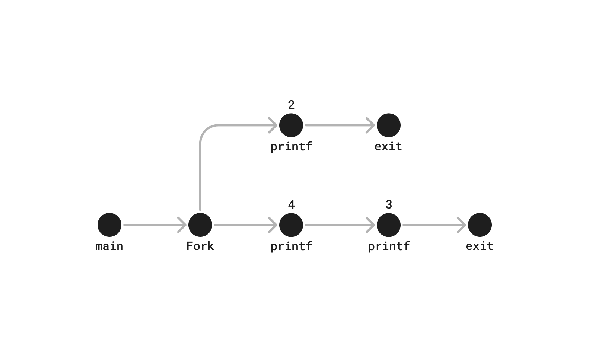

```c
#include "csapp.h"

int main()
{
    int x = 3;

    if (Fork() != 0)
        printf("x=%d\n", ++x); // parent

    printf("x=%d\n", --x);
    exit(0);
}
```
One possible option can be:
```
x=4
x=3
x=2
```


