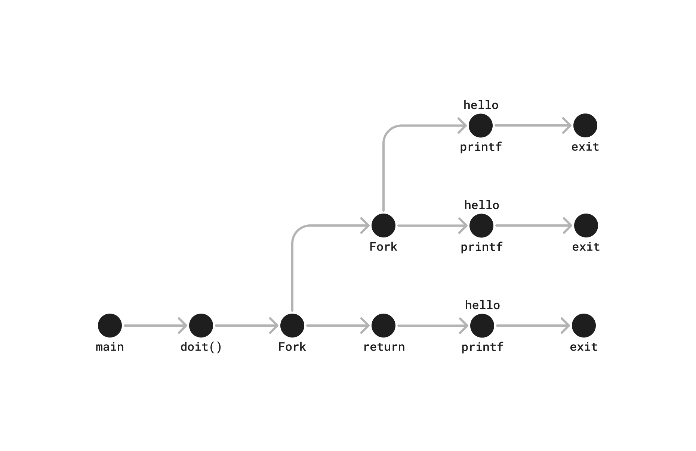

```c
#include "csapp.h"

void doit()
{
    if (Fork() == 0) { // child
        Fork();
        printf("hello\n");
        exit(0);
    }
    return;
}

int main()
{
    doit();
    printf("hello\n");
    exit(0);
}
```

3 times


