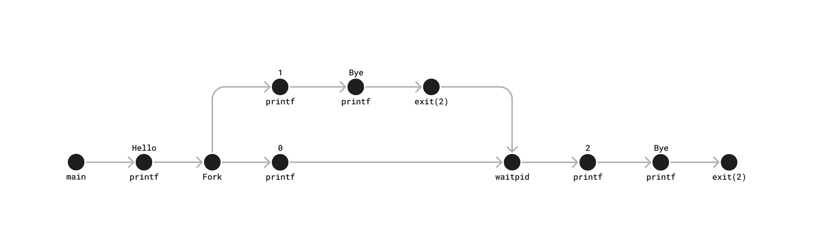

```c
int main()
{
    int status;
    pid_t pid;

    printf("Hello\n");
    pid = Fork();
    printf("%d\n", !pid);
    if (pid != 0) {
        if (waitpid(-1, &status, 0) > 0) {
            if (WIFEXITED(status) != 0)
                printf("%d\n", WEXITSTATUS(status));
        }
    }
    printf("Bye\n");
    exit(2);
}
```



Parent process output:
```
Hello
0
2
Bye
```

Child process output:
```
1
Bye
```
while The child process output starts after `1` is printed and ends before `2` of the parrent process is printed.


Option 1:
```
Hello
1
Bye
0
2
Bye
```

Option 2:
```
Hello
1
0
Bye
2
Bye
```

Option 2:
```
Hello
0
1
Bye
2
Bye
```
