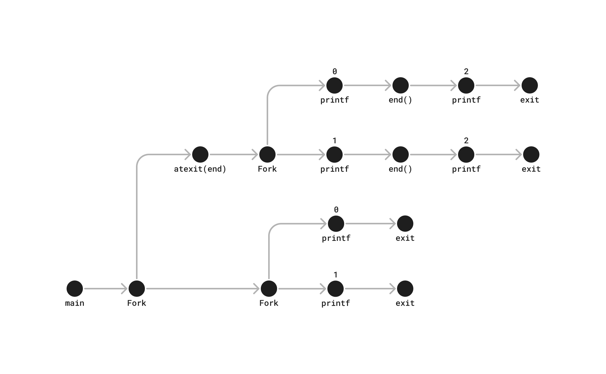
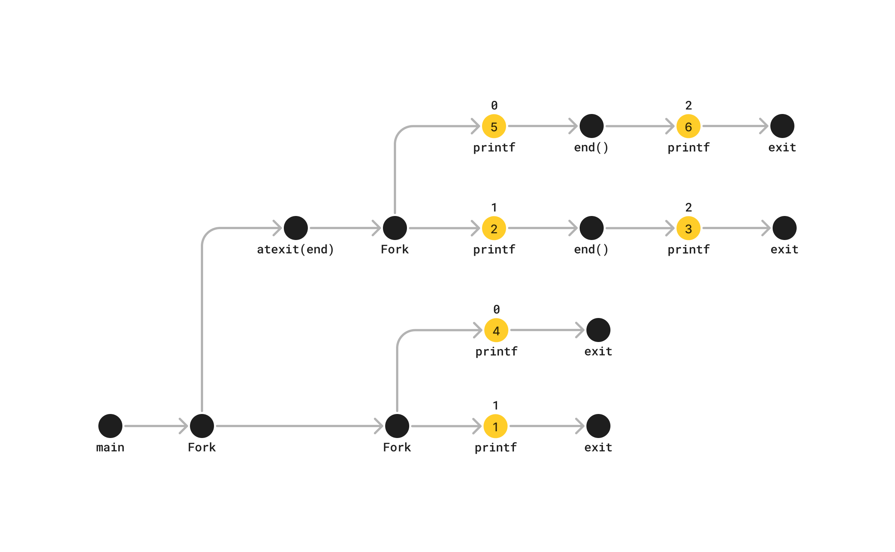

```c
#include "csapp.h"

void end(void)
{
    printf("2"); fflush(stdout);
}

int main()
{
    if (Fork() == 0)
        atexit(end);
    if (Fork() == 0) {
        printf("0"); fflush(stdout);
    }
    else {
        printf("1"); fflush(stdout);
    }
    exit(0);
}
```

> Note: The atexit function takes a pointer to a function and adds it to a list of functions (initially empty) that will be called when the exit function is called.

A, C, and E are possible options.



## A. 112002 
Possible. Prints (and context switches) can happen in the following order:


## B. 211020
Impossible. There is not combination where `2` is printed first.

## C. 102120
Possible. Prints (and context switches) can happen in the following order:


## D. 122001
Impossible. There must be a `0` or a `1` before each `2`.

## E. 100212
Possible. Prints (and context switches) can happen in the following order:

